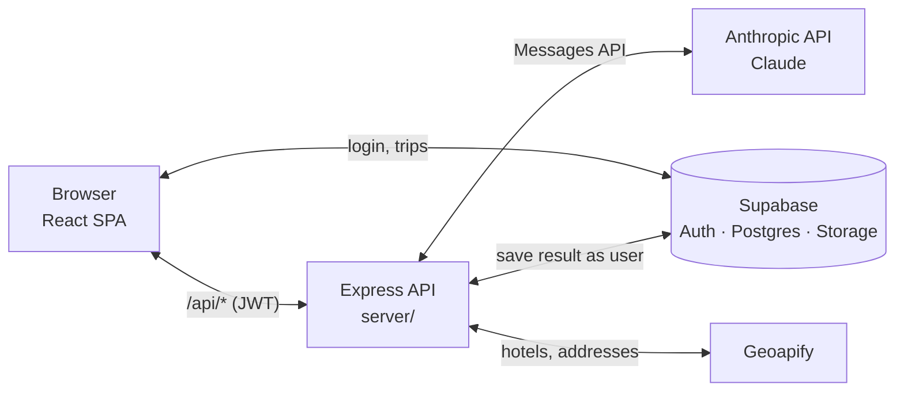

# Trip Planner

An AI-powered travel planning web app. A signed-in user describes a trip, and the app uses Claude to generate a day-by-day itinerary, with a map of each day's stops and a list of local events happening during the trip.

📄 A printable version of this overview is in [docs/Trip-Planner-Overview.pdf](docs/Trip-Planner-Overview.pdf).

## What it does

- **Plan a trip**: a four-step questionnaire collects the country, one or more cities with check-in/check-out dates, where the traveler is staying (a hotel found through hotel search, a custom address, or none), and their travel style and vacation type. Addresses are validated as they're entered.
- **Background generation**: the trip is saved immediately as *pending*, and the server generates the itinerary with Claude. The user sees an animated progress screen and can leave; the finished itinerary appears on their dashboard when it's ready.
- **Dashboard**: every trip is a card with a status: *Draft* (questionnaire saved part-way), *Pending*, *Ready*, or *Failed* (with Retry). Cards update live while anything is generating.
- **Itinerary view**: a per-day interactive map (stops and hotel), the day's stops in order, tips and hotel details, plus a Local Events section with details for each event.
- **Accounts**: email/password sign-in, password reset, and a profile page with name and avatar upload.
- **Installable**: a Progressive Web App with offline caching of the app shell and map tiles.

## Technology

### Frontend

A single-page app in [`src/`](src/).

| Technology | Used for |
|---|---|
| React 18 | UI, function components and hooks |
| Vite 5 | Dev server and production build; compiles Tailwind through PostCSS |
| React Router 6 | Routes: `/`, `/new`, `/drafts/:id`, `/trip/:id`, `/profile` |
| TanStack Query 5 | Fetching and caching trips; polls every 4 s while a trip is pending |
| Tailwind CSS 3 | Styling; one shared theme in [`src/utils/theme.js`](src/utils/theme.js) |
| Framer Motion | Animations: page transitions, modals, the loading screen's globe and plane |
| Leaflet + react-leaflet | Interactive maps on OpenStreetMap tiles |
| lucide-react | Icons |
| vite-plugin-pwa | Service worker and web-app manifest |

### Backend and services

| Technology | Used for |
|---|---|
| Node.js + Express 5 | API server in [`server/`](server/) (port 3001): itinerary generation, hotel search, address validation. Holds the secret API keys. |
| Anthropic SDK | Calls Claude (`claude-sonnet-5`) with streaming to generate the itinerary as JSON |
| Supabase | Authentication, Postgres database (`trips`, `members`) and file storage (avatars). Used directly by the browser, and by the server acting as the signed-in user. |
| Geoapify | Hotel search near a city, and address geocoding/validation |
| Docker + GitHub Actions | Multi-stage image (built frontend + server); CI builds and pushes the image |

## Architecture

The browser talks to Supabase directly for sign-in and for reading or writing trips. Anything that needs a secret key goes through the Express server.



### How an itinerary is generated

1. The user finishes the questionnaire. The browser saves the trip to Supabase with status *pending* and its form answers.
2. The browser calls `POST /api/generate-itinerary` with only the trip id and the user's login token, then opens `/trip/:id`, which shows the progress screen.
3. The server reads the trip's answers from Supabase as that user, replies right away, and continues in the background: it builds the prompt, streams the response from Claude and parses the JSON.
4. The server writes the itinerary back to the trip with status *ready* (or *failed* with the error). A trip still pending after 10 minutes is treated as failed.
5. The progress screen and the dashboard poll the trip every 4 seconds and switch to the itinerary as soon as it's ready, even if the user left and came back.

Statuses are stored inside the trip's `itinerary_data` JSON, so no database schema change was needed. A mock mode (`VITE_USE_MOCK_DATA=true`) skips the API and returns sample data for UI work.

## Component tree

How the React components nest at runtime, starting from [`src/main.jsx`](src/main.jsx). Notes on the right give the route or the condition under which a branch renders. `(local)` marks a component defined inside its parent's file.

```
main.jsx
└── QueryClientProvider                server-data cache (TanStack Query)
    └── AuthProvider                   one Supabase auth subscription; useAuth()
        └── AuthGate                   shows login until signed in
            ├── LoginPassword          signed out
            ├── ResetPassword          password-recovery link
            └── BrowserRouter          signed in
                └── App                <Routes>
                    ├── DashboardPage                      /
                    │   ├── SkyBackground
                    │   ├── ProfileMenu
                    │   ├── TripCardMenu (local)           per-card actions
                    │   └── StatusBadge                    draft / pending / ready / failed
                    ├── NewTripPage                        /new, /drafts/:draftId
                    │   ├── LoadingScreen                  while a draft loads
                    │   └── TripQuestionnaire              4-step form
                    │       ├── WhereWhenStep              country, cities, dates
                    │       │   └── CityAutocomplete (local)
                    │       ├── AccommodationStep          hotel / address / skip
                    │       │   ├── HotelSearchModal       Geoapify search
                    │       │   └── Modal                  skip-homebase confirm
                    │       ├── StyleStep                  travel style, vacation type
                    │       └── ReviewStep
                    ├── TripPage                           /trip/:tripId (picks a view by status)
                    │   ├── GeneratingScreen               pending: globe + plane
                    │   ├── FailedScreen (local)           failed: error + Try again
                    │   └── TripView (local)               ready
                    │       ├── SkyBackground
                    │       ├── ProfileMenu
                    │       ├── SideNav                    days, Local Events, Food Spots
                    │       ├── DayMap                     Leaflet map of the day
                    │       │   ├── MarkerInfoModal        uses Modal
                    │       │   └── HotelInfoModal         uses Modal
                    │       ├── ItineraryCard
                    │       │   └── TodayStopsList
                    │       └── EventsPanel                Local Events section
                    │           ├── EventImage             photo or category icon
                    │           └── EventModal             uses Modal + EventImage
                    └── ProfilePage                        /profile
                        └── SkyBackground
```

## Running locally

Requires Node.js 20.6+ (the server script uses `--env-file`). Create a `.env` file in the project root:

```bash
VITE_SUPABASE_URL=...
VITE_SUPABASE_ANON_KEY=...
ANTHROPIC_API_KEY=...
GEOAPIFY_API_KEY=...
# Optional: use sample data instead of calling Claude
# VITE_USE_MOCK_DATA=true
```

Then:

```bash
npm install
npm run dev:all   # Express API on :3001 (auto-restarts on save) + Vite on :3000
```

## Roadmap

- **Food Spots** section in the itinerary
- Download an itinerary as a PDF
- Edit a generated trip
