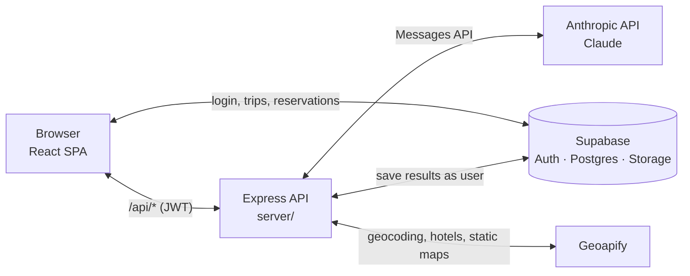

# Trip Planner

An AI-powered travel planning web app. A signed-in user describes a trip, and the app uses Claude to generate a day-by-day itinerary, with a map of each day's stops, local events, the best places to eat nearby, and all their flight and hotel confirmation codes in one place. Any trip can be downloaded as a PDF for use offline.

📄 A printable version of this overview is in [docs/Trip-Planner-Overview.pdf](docs/Trip-Planner-Overview.pdf).

## What it does

- **Plan a trip**: a five-step questionnaire collects the country and one or more cities with check-in/check-out dates; flight details (optional); where the traveler is staying (a hotel found through hotel search, a custom address, or none) with an optional hotel confirmation code; and their travel style and vacation type. Addresses are validated as they're entered.
- **Background generation**: the trip is saved immediately as *pending*, and the server generates the itinerary with Claude. Flight times are used to keep arrival days light and leave time for the airport. The user sees an animated progress screen and can leave; the finished itinerary appears on their dashboard when it's ready.
- **Dashboard**: every trip is a card with a status: *Draft* (questionnaire saved part-way), *Pending*, *Ready*, or *Failed* (with Retry). Cards update live while anything is generating; click a card to open it.
- **Itinerary view**: a per-day interactive map (stops and hotel), the day's stops in order, and tips and hotel details. A side menu opens three more sections:
  - **Local Events** happening during the trip, with details for each one.
  - **Food Spots**: the top 12 places to eat in each city, generated alongside the itinerary, with "Load 10 more". Each spot shows its cuisine, price, neighborhood and distance from the traveler's hotel, and is pinned on a map next to the hotel. A toggle sorts the list by "Closest to homebase".
  - **Reservations**: every flight and hotel with its confirmation code (tap to copy). Hotels from the questionnaire appear automatically; flights and other hotels can be added, edited or deleted.
- **Offline PDF**: "Download PDF" (on the itinerary page and in each trip's ⋮ menu) builds a PDF with the reservations and codes, a map and stop list for every day, 10 local events, and 10 food spots per city.
- **Accounts**: email/password sign-in, password reset, and a profile page with name and avatar upload.
- **Installable**: a Progressive Web App with offline caching of the app shell and map tiles.

## Technology

### Frontend

A single-page app in [`src/`](src/).

| Technology | Used for |
|---|---|
| React 18 | UI, function components and hooks |
| Vite 5 | Dev server and production build; compiles Tailwind through PostCSS |
| React Router 6 | Routes: `/`, `/new`, `/drafts/:id`, `/trip/:id`, `/profile` |
| TanStack Query 5 | Fetching, caching and saving trips; polls every 4 s while a trip is pending |
| Tailwind CSS 3 | Styling; one shared theme in [`src/utils/theme.js`](src/utils/theme.js) |
| Framer Motion | Animations: page transitions, modals, the loading screen's globe and plane |
| Leaflet + react-leaflet | Interactive maps on OpenStreetMap tiles |
| lucide-react | Icons |
| vite-plugin-pwa | Service worker and web-app manifest |

### Backend and services

| Technology | Used for |
|---|---|
| Node.js + Express 5 | API server in [`server/`](server/) (port 3001): itinerary generation, food spots, PDF export, hotel search, address validation. Holds the secret API keys. |
| Anthropic SDK | Calls Claude (`claude-sonnet-5`): streams the itinerary as JSON, and picks food spots (at low effort, for speed) |
| Supabase | Authentication, Postgres database (`trips`, `members`) and file storage (avatars). Used directly by the browser, and by the server acting as the signed-in user. |
| Geoapify | Hotel search, address validation, map coordinates for food spots and homebases, and static map images for the PDF |
| pdfkit | Builds the offline PDF on the server |
| Docker + GitHub Actions | Multi-stage image (built frontend + server); CI builds and pushes the image |

### Server modules

| File | What it does |
|---|---|
| [`server/index.js`](server/index.js) | Express routes; reads and writes trips as the signed-in user |
| [`server/itinerary.js`](server/itinerary.js) | Builds the itinerary prompt, calls Claude, parses the JSON |
| [`server/foodSpots.js`](server/foodSpots.js) | Asks Claude for a city's best places to eat, then locates them on the map |
| [`server/geoapify.js`](server/geoapify.js) | Geocoding, homebase lookup and static maps, rate-limited to the free tier (≤ 4 requests/s) |
| [`server/pdf.js`](server/pdf.js) | Lays out the offline PDF |

## Architecture

The browser talks to Supabase directly for sign-in and for reading or writing trips. Anything that needs a secret key goes through the Express server.



### How an itinerary is generated

1. The user finishes the questionnaire. The browser saves the trip to Supabase with status *pending* and its form answers.
2. The browser calls `POST /api/generate-itinerary` with only the trip id and the user's login token, then opens `/trip/:id`, which shows the progress screen.
3. The server reads the trip's answers from Supabase as that user, replies right away, and continues in the background. In parallel, it:
   - streams the itinerary from Claude (the prompt includes flight routes and times, but never confirmation codes),
   - asks Claude for 12 food spots per city and finds each one on the map with Geoapify,
   - looks up each city's hotel or homebase location.
4. The server merges everything into the trip with status *ready* (or *failed* with the error), re-reading the row first so edits made in the meantime aren't overwritten. A trip still pending after 10 minutes is treated as failed.
5. The progress screen and the dashboard poll the trip every 4 seconds and switch to the itinerary as soon as it's ready, even if the user left and came back.

### What's stored on a trip

Everything lives in the trip row's `itinerary_data` JSON, so no database schema changes were needed:

| Key | Contents |
|---|---|
| `days`, `spots`, `events` | The itinerary from Claude |
| `_form_data` | The questionnaire answers, including `reservations` (flights and hand-added hotels) and each hotel's confirmation code |
| `_status`, `_error` | `pending` / `ready` / `failed` (drafts are marked with `_draft`) |
| `_food_spots` | Food spots per city, with coordinates |
| `_homebases` | Each city's hotel or homebase location, for distances and the map |

A mock mode (`VITE_USE_MOCK_DATA=true`) skips the API and returns sample data for UI work.

## Component tree

How the React components nest at runtime, starting from [`src/main.jsx`](src/main.jsx). Notes on the right give the route or the condition under which a branch renders. `(local)` marks a component defined inside its parent's file.

```
main.jsx
└── QueryClientProvider                server-data cache (TanStack Query)
    └── AuthProvider                   one Supabase auth subscription; useAuth()
        └── AuthGate                   shows login until signed in
            ├── LoginPassword          signed out
            ├── ResetPassword          password-recovery link
            └── BrowserRouter          signed in
                └── App                <Routes>
                    ├── DashboardPage                      /
                    │   ├── SkyBackground
                    │   ├── ProfileMenu
                    │   ├── TripCardMenu (local)           Download PDF / Retry / Delete
                    │   └── StatusBadge                    draft / pending / ready / failed
                    ├── NewTripPage                        /new, /drafts/:draftId
                    │   ├── LoadingScreen                  while a draft loads
                    │   └── TripQuestionnaire              5-step form
                    │       ├── WhereWhenStep              country, cities, dates
                    │       │   └── CityAutocomplete (local)
                    │       ├── FlightsStep                optional flights
                    │       │   └── FlightFields
                    │       ├── AccommodationStep          hotel / address / skip, hotel code
                    │       │   ├── HotelSearchModal       Geoapify search
                    │       │   └── Modal                  skip-homebase confirm
                    │       ├── StyleStep                  travel style, vacation type
                    │       └── ReviewStep
                    ├── TripPage                           /trip/:tripId (picks a view by status)
                    │   ├── GeneratingScreen               pending: globe + plane
                    │   ├── FailedScreen (local)           failed: error + Try again
                    │   └── TripView (local)               ready; Download PDF button
                    │       ├── SkyBackground
                    │       ├── ProfileMenu
                    │       ├── SideNav                    days, Local Events, Food Spots, Reservations
                    │       ├── DayMap                     Leaflet map of the day
                    │       │   ├── MarkerInfoModal        uses Modal
                    │       │   └── HotelInfoModal         uses Modal
                    │       ├── ItineraryCard
                    │       │   └── TodayStopsList
                    │       ├── EventsPanel                Local Events section
                    │       │   ├── EventImage             photo or category icon
                    │       │   └── EventModal             uses Modal + EventImage
                    │       ├── FoodSpotsPanel             Food Spots section
                    │       │   └── DayMap                 spots + hotel pins, no popups
                    │       └── ReservationsPanel          Reservations section
                    │           └── Modal                  add / edit form
                    │               ├── FlightFields
                    │               └── HotelFields
                    └── ProfilePage                        /profile
                        └── SkyBackground
```

## Running locally

Requires Node.js 20.6+ (the server script uses `--env-file`). Create a `.env` file in the project root:

```bash
VITE_SUPABASE_URL=...
VITE_SUPABASE_ANON_KEY=...
ANTHROPIC_API_KEY=...
GEOAPIFY_API_KEY=...
# Optional: use sample data instead of calling Claude
# VITE_USE_MOCK_DATA=true
```

Then:

```bash
npm install
npm run dev:all   # Express API on :3001 (auto-restarts on save) + Vite on :3000
```

## Roadmap

- Edit a generated trip
